# Welcome to the Dublin Explorer Blog!

This project marks a significant milestone in my journey as a Full Stack Software Developer, as part of my participation in [Code Institute's](https://codeinstitute.net) Full Stack Software Developer Diploma. The **Dublin Discovery Blog** is a platform dedicated to sharing and exploring experiences in the captivating capital of Ireland, Dublin.

*The site is currently populated by posts with content generated from [ChatGPT](https://chat.openai.com/)*
 

## Project Overview

The **Dublin Discovery Blog** is a dynamic blog where travelers, locals, and adventurers can share their unique experiences, insights, and tips about Dublin. Whether you're planning a visit, reminiscing about past trips, or simply interested in the charm of Dublin, this blog has something for everyone.

## Key Features

- **Create, Edit, and Delete Posts**: Users have the ability to create posts, update them, or remove them as their adventures unfold.

- **Interactive Engagement**: The platform encourages interaction through comments and likes on posts, fostering a sense of community and conversation.

- **Category**: Discovery Dublin through various categories, making it easier to find posts that pique your interest.

- **User Authentication and Permissions**: Security is a priority. The project includes user authorization and permissions to ensure a safe and personalized experience.

## Technology Stack

- **Django**: The backbone of this project, utilizing Django as the main MVC (Model-View-Controller) technology to efficiently manage and display information from the database.

- **Relational Database**: A robust relational database schema stores data, ensuring reliability and structured information storage.

- **Agile Methodology**: Agile software development methodology is employed for effective planning and development, allowing for flexibility and adaptability.

- **Deployment on Heroku**: The project is deployed on [Heroku](https://signup.heroku.com/), making it accessible to a global audience.

## Target Audience

The **Dublin Discovery Blog** is designed for individuals who share a passion for travel, especially those planning a visit to Dublin. It serves as a valuable resource to discover authentic experiences, insights, and recommendations from fellow explorers. Whether you're an avid traveler or simply curious about Dublin, you'll find inspiration and information here.

Thank you for joining us on this journey of exploration and discovery in Dublin!

## Milestones

The project milestones were developed following the Agile methodology and in conjunction with the project's objectives. These milestones include:

- **User Experience Design**: Focused on enhancing the general site aesthetics and user experience.
- **CRUD Functionality**: Implemented Create, Read, Update, and Delete operations for manipulating data on the front-end.
- **User Authentication**: Ensured that users can only access relevant and appropriate parts of the site, enhancing security.
- **Login & Logout**: Implemented safe and secure login and logout protocols, providing a smooth user experience.
- **Create Account**: Enabled new users to join the Dublin Discovery forum.
- **Admin Panel**: Empowered site administrators to manage users and data effectively.
- **Interaction**: Allowed users to engage with other user's data through comments and likes.

## Epics

The main features required for this project were organized into Epics, each encapsulating general functionality for specific features and aligning with the project milestones. Below are the details of each Epic:

### Register

- **Details**: Registration is required for users who wish to interact with the platform by adding posts, liking posts, or leaving comments. User management is handled through the Django Admin panel. Access to content is available to all users, but registration is necessary for interactive features.

### Login & Logout

- **Details**: Users are encouraged to log in to add content to the platform. Once logged in, they can interact with the main content. For security reasons, users have the option to log out at any time. Access to specific pages is determined by the user's status, whether they are a general user or staff/admin

### Admin

- **Details**: Users with admin privileges have 'staff' access, allowing them to view all areas of the site, manage posts, comments, likes, categories, and other users.

### View Posts

- **Details**:  Users can freely browse the existing post instances in the database without the need for authentication. They have access to a general list of posts. Additionally, users can view an individual post in detail.

### Create Post

- **Details**: Users, once authenticated, have the ability to craft new posts under their own username as the author. This includes specifying a title, category, and body for the post. Upon submission, posts are timestamped with the creation date and promptly made accessible to other users.

### Update Post

- **Details**: For authenticated users who are the original authors of a post, the capability to modify the content of pre-existing posts is available. Editing enables the update of fields within the post, effectively updating the corresponding database instance. Editing pre-populates the post's current content on the editing page.

### Delete Post

- **Details**: Authenticated users who are the authors of a post can fully and permanently delete a post from the database through the Post page. Users are given a confirmation page with the choice to return or continue and delete the post, with a confirmation message upon successful deletion.

### UX (User Experience)

- **Details**: Design features were implemented to enhance the user experience (UX), making it ergonomically and aesthetically pleasing, as well as simple and intuitive to navigate.
 

### For Non-Registered New Users:

- **Landing Page**:I want the first page to feature a captivating image of Dublin and provide essential information about the blog under an "About Us" section. Additionally, I expect to see the three most recent posts displayed prominently on this page, with easy access to social media links.
- **User Registration**: I want the ability to register for an account with a username, an optional email, and a password.
- **Post Details**: I want be able to navigate to a full-page view of any post in the list views
- **Immediate Access**: I expect to navigate to the site's content immediately after creating my account.
- **User-Friendly Navigation**: I want an intuitive and user-friendly navigation experience during my first visit.
- **Browser Tab Title**: I expect the page title to be reflected in the browser tab.

### For Registered Users:

- **Safe Login and Logout**: I want to log in and out of the site safely and see confirmation messages for successful login and logout.

### For Registered and Logged-In Users:

- **Consistent Login State**: I expect to see confirmation that I am logged in on all site pages.
- **Post List Views**: I want to view a condensed list of all forum posts, categorized by topics or tags.
- **Post Details**: I should be able to navigate to a full-page view of any post in the list views.
- **Create New Posts**: I need to navigate to a page to create a new post.
- **Post Updates and Deletions**: I want be able to update or delete posts.
- **Efficient Post Submission**: I want to submit my new post without having to input my own username as the author.
- **Post Permissions**: I should be the only one with permission to edit and update my posts.
- **Post Deletions**: I should be the only one who can delete my posts.
- **Like and Comment**: I want to see the number of likes a post has and be able to like or unlike it.
- **User Comments**: I should be able to comment on other users' posts.
- **Site Information**: I expect to see social links and site information the most relevant pages.
- **Responsive Design**: I want to view the site clearly on any device.

### For Admins:

- **Post Management**: As an admin, I need to create, read, update, and delete posts or manage posts through the admin panel.
- **User Management**: I want to view and manage all users through the admin panel.
- **Comment Approval**: I need to approve comments in the admin panel.

## Wireframes

### Navigation Bar
- **Sign In**: Access your account by providing your username and password.
- **Sign Up**: Create your account with a username, optional email, password, and password confirmation.
- **Home Page**: Return to the welcoming home page.
- **Community Connect**: Explore and engage with the Dublin community.

(Authenticated Users)
- **Log Out**: Confirm your decision to log out, ensuring a seamless transition to the home page.
- **Add Post**: Share your Dublin experiences with the community.

### Home Page
- **Dublin Discovery**: The title takes center stage, capturing your attention.
- **Welcome Message**: A warm welcome message awaits, inviting you to explore Dublin.
- **About Us**: Discover the blog's purpose and mission in the "About Us" section.
- **Recent Posts**: Dive into the three most recent posts to uncover Dublin's hidden gems.
- **Social Media**: Stay connected through our social media links in the footer.

### Post List Page
- Explore a comprehensive list of posts, each presented in an individual box.
- Quickly scan post details, including title, category, author, and creation date.
- Keep track of post popularity with visible like and comment counts.

### Post Page
- Immerse yourself in the complete post content.
- Engage with the community by leaving comments and expressing your appreciation with the "Like" button.
- Authors have the power to update or delete their posts directly from the post page.

### Login Pages
- **Sign Up**: Create your account with a username, optional email, password, and password confirmation.
- **Sign In**: Access your account by providing your username and password.
- **Log Out**: Confirm your decision to log out, ensuring a seamless transition to the home page.

## Database

The database schema for Dublin Discovery was carefully designed to align with a typical forum structure. It efficiently captures and stores essential data related to forum posts and user interactions. The database is hosted on [ElephantSQL](https://www.elephantsql.com/) and utilizes a [PostgreSQL](https://www.postgresql.org/) relational database structure to store Django models data.

### Post Model
- **Title**: Captures the title of a forum post.
- **Unique Slug**: Generates a unique slug for each post.
- **Author**: Records the author of the post.
- **Date Added and Updated**: Tracks the date and time of post creation and updates.
- **Body**: Contains the main content of the post.
- **Likes**: Keeps a count of user likes for the post.
- **Primary Key**: Generates a unique primary key for each post.
- *Future Developments*: Potential enhancements may include media, file upload, and tag fields.

### Comments Model
- Allows users to leave comments on posts, whether they authored the post or not.
- Comments are saved in the model and displayed alongside post content in templates.

### Contact Model
- Collects user data via a contact form.
- Stores contact form submissions, making them viewable by administrators in the Django admin panel.

The database structure efficiently supports the core functionality of Dublin Discovery and provides a solid foundation for future enhancements and features.

## Agile Methodology

The following images represent evidence for an [Agile Methodology](https://agilemanifesto.org/) in the development of this project. Once user stories were developed and inputted they become part of the project backlog and managed.
<table>
<tr>
<td>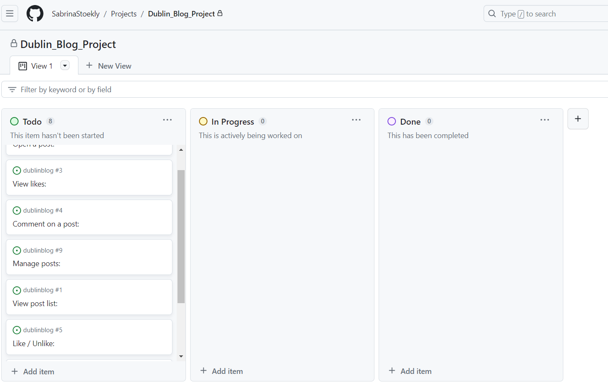</td>
<td>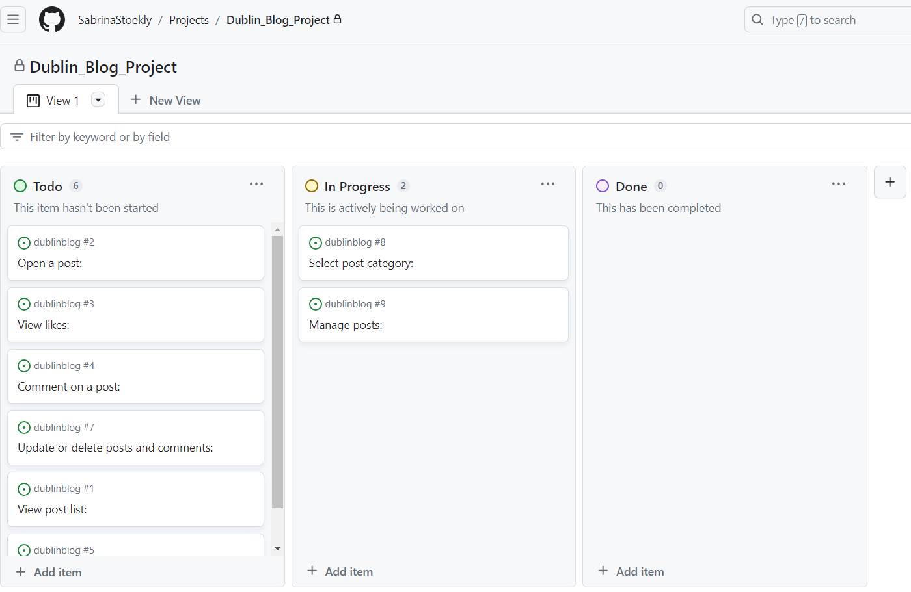</td>
</tr>
<tr>
<td>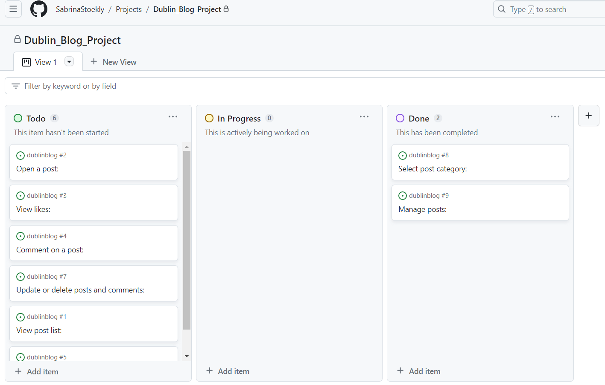</td>
<td>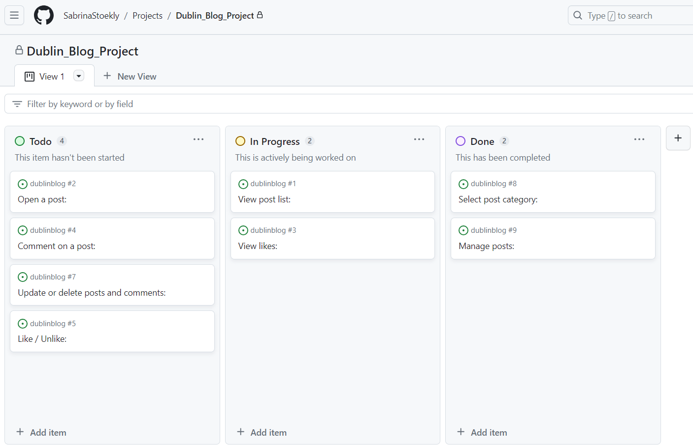</td>
</tr>
<tr>
<td>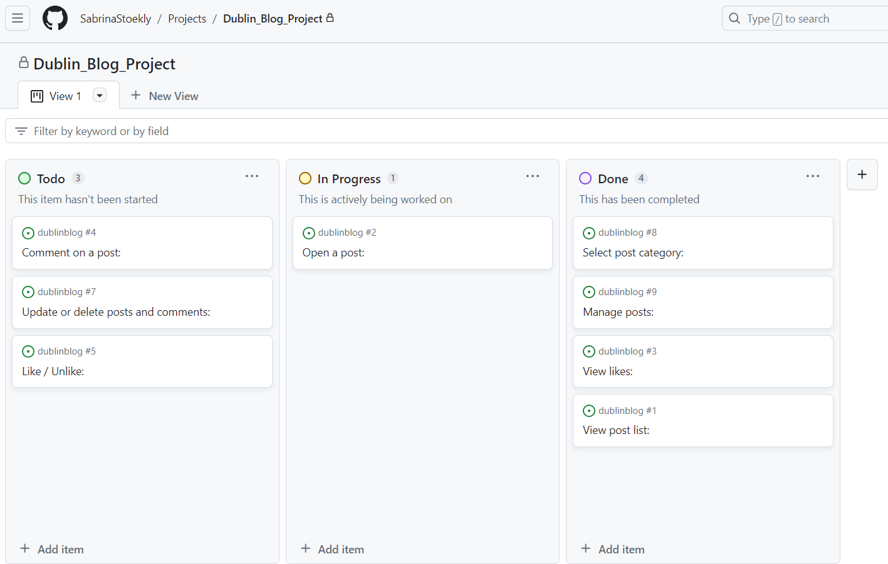</td>
<td>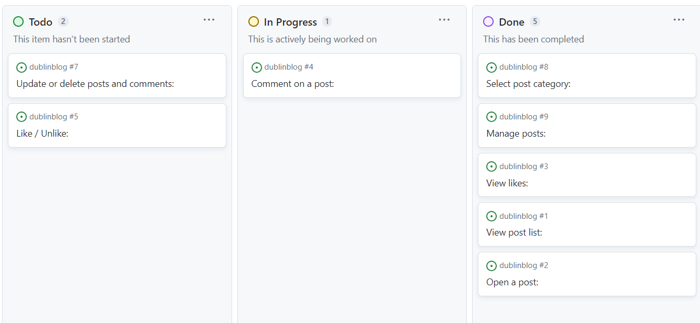</td>
</tr>
<tr>
<td>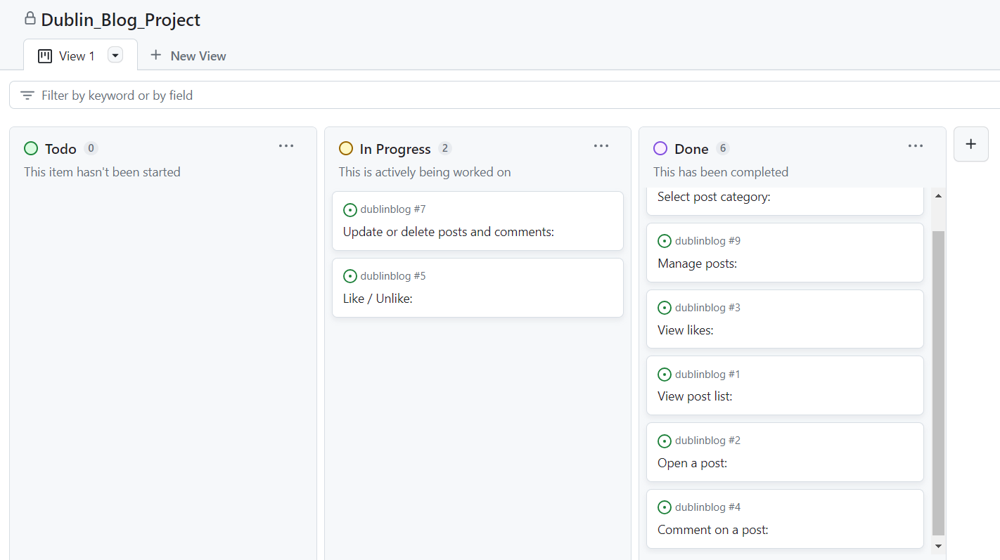</td>
<td>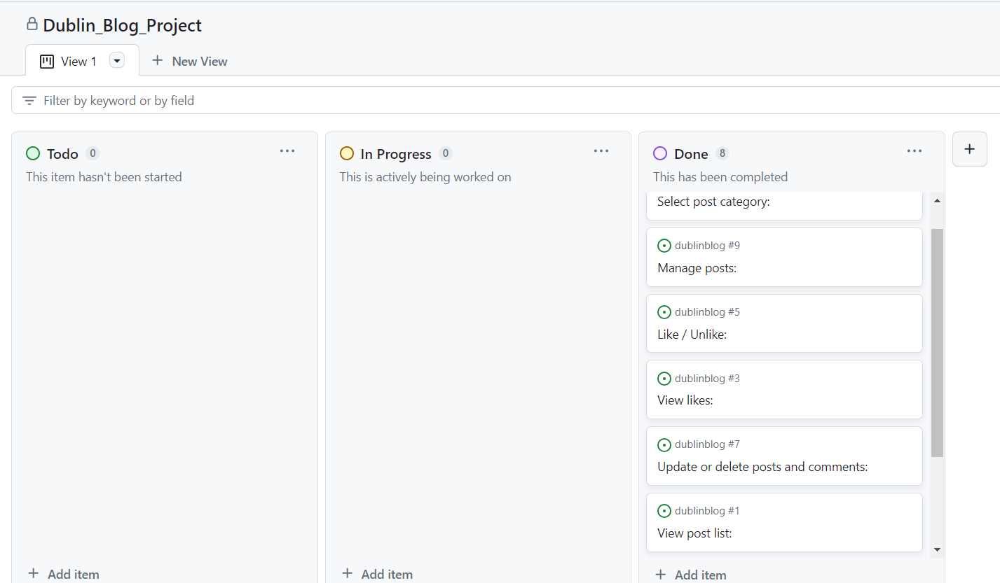</td>
</tr>
</table>

 

# Main Features
## User Experience (UX) Design

### Typography
Dublin Discovery places a strong emphasis on user experience, including thoughtful typography choices. We've carefully selected fonts from [Google Fonts](https://fonts.google.com/) to enhance the visual appeal and accessibility of the site's design.

#### Source Code Pro
- **Usage**: Source Code Pro is prominently featured for titles, navigation, and other key elements, often in full capitalization.
- **Weights**: We leverage two distinct weights of Source Code Pro: SemiBold 600 for bold emphasis and Extra Light 200 for a delicate touch.

#### Oxygen Mono
- **Usage**: Oxygen Mono takes the lead for regular body text, paragraphs, and buttons, consistently presented in lowercase format.
- **Weight**: Oxygen Mono maintains a Regular weight of 400, ensuring clear and readable text.

### Color
Dublin Discovery adopts a minimalist and elegant black-and-white design, strategically incorporating color to accentuate essential elements.

- **Font**: We've chosen 'Poppins' as our primary font, belonging to the sans-serif font family.
- **Colors**: Our carefully curated color palette includes key shades:
  - #070706: A deep, dark hue providing text contrast and visual impact.
  - #FFF: Crisp white for optimal readability.
  - #666: A subtle gray for text and less prominent elements.
  - #161813: A slightly off-black shade to complement design accents.
  - #E85D04: A vibrant highlight color for important buttons and elements.

Our meticulous attention to typography and color selection contributes to an exceptional user experience, enhancing both readability and visual appeal while maintaining a minimalist design.

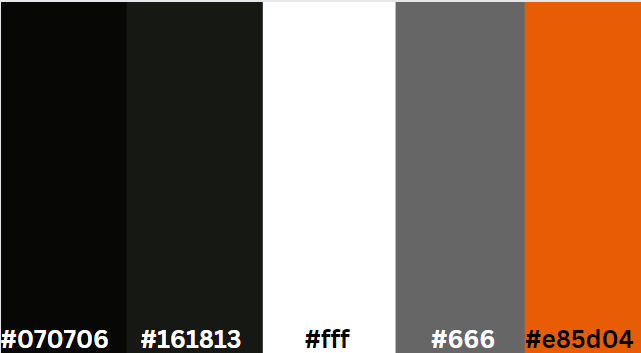

## CRUD Functionality

Create, read, update, and delete functionalities are fundamental components of this project. Below, we provide details on how these functions are seamlessly integrated into the front-end of the Dublin Discovery website.

### Add Post

The first cornerstone of CRUD functionality is the ability for authenticated users to create new posts. Users can access this page to generate a new post, thereby creating a fresh instance within the Post database model.

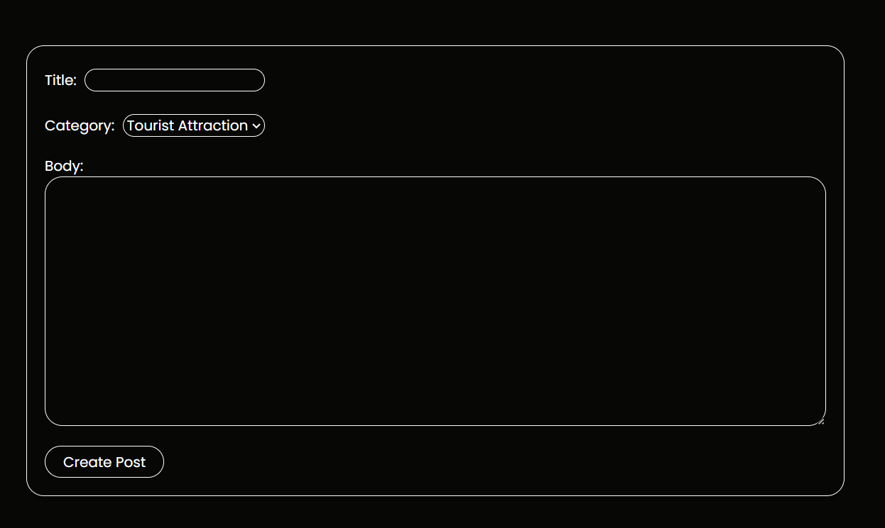

### Update Posts

Similar to the add post functionality, the update post page allows users to edit the contents of an existing database instance within the Post model. Users can navigate to this page by clicking the 'edit' button on a post card, but only if they are recognized as the post's author.

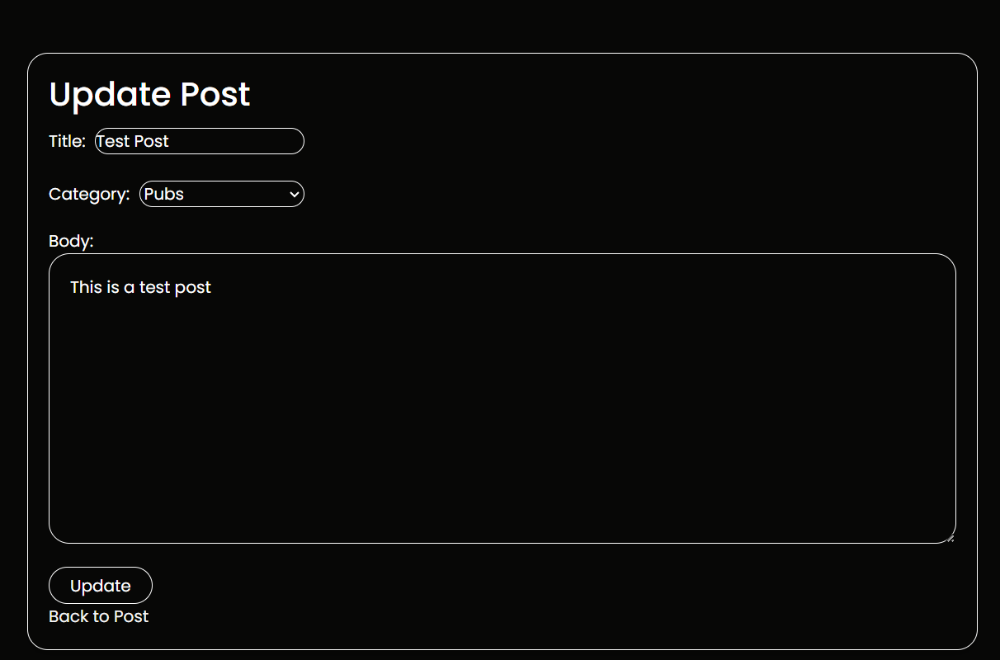

### Delete Post

Users with the appropriate permissions (i.e., the author of a post) can access the update post page for a particular post, where they also have the option to delete the post. Clicking the delete button directs the user to a confirmation page, where they can confirm their intent to delete the post permanently.

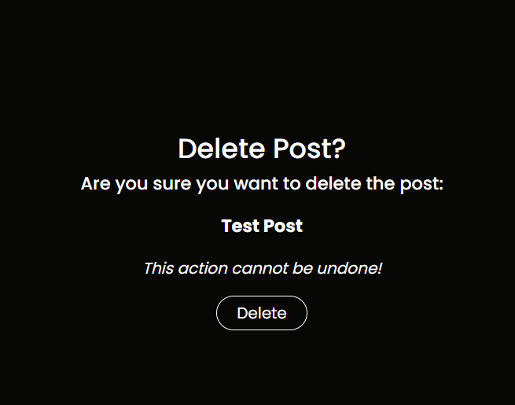

These CRUD functionalities empower users to interact with the Dublin Discovery platform efficiently, whether it's creating new content, exploring existing posts, or managing their own contributions.

# Future Developments

Dublin Discovery has a promising future with the potential to expand its functionality and enhance the user experience. Here are some exciting possibilities for future developments:

- **Pagination**: Implement page loading by a certain number of posts (e.g., 10 posts) when there are numerous posts to improve the user experience.

- **Draft Saving**: Allow users to save posts as drafts before publishing, giving them more control over their content creation process.

- **User Post Management**: Provide users with a centralized page to manage all their posts conveniently.

- **Password Management**: Add features like reset password and forgotten password links to enhance user account security and recovery.

- **Site-Wide Search**: Implement a robust search function that allows users to search for content site-wide, making it easier to find specific posts.

- **Tagging System**: Enable users to add tags to their posts and create a tag cloud in the sidebar for effortless navigation.

- **Rich Text Editor**: Incorporate a rich text editor on the front end to allow for formatting when creating and displaying posts.

- **Improved Contact Form**: Enhance the contact form by removing redundant user checkboxes and automating membership checks on submission.

- **User Profiles**: Create personal profile pages where users can add and update their public information, accessible via a link from their name on posts.

- **Linked Author Profiles**: Link post author profiles to their relevant posts for public viewing and exploration.

- **Mobile Footer**: Enhance the mobile user experience by ensuring the footer is readily accessible without the need to scroll to the end of the post list.

- **User-Generated Media**: Enable users to upload various media types (e.g., videos, audio, PDFs, files) alongside their posts and provide tagging options.

- **Practice Session Logging**: Create an app or feature for users to log their travel experiences, including details like duration, location, activities, notes, and more. Allow users to gain insights based on their shared travel data.

These potential future developments aim to enrich the Dublin Discovery travel blog, offering enhanced features and a more immersive user experience.

# Technologies
Dublin Discovery incorporates a range of technologies to power its functionality and design:

- [Django](https://www.djangoproject.com/): Utilized for rendering the database models and templates, making it the core framework of the project.

- [ElephantSQL](https://www.elephantsql.com/): Selected for hosting and managing the project's database, ensuring seamless data storage.

- [HTML](https://en.wikipedia.org/wiki/HTML): Fundamental for creating web templates and enabling navigation between them.

- [CSS](https://en.wikipedia.org/wiki/CSS): Employed for custom styling, ensuring an appealing and user-friendly interface.

- [AllAuth](https://django-allauth.readthedocs.io/en/latest/): Integrated Django application responsible for handling authentication, registration, and account management seamlessly.

- [Summernote](https://summernote.org/): A text editor used to facilitate content creation and editing.

Additionally, you can find further project requirements outlined in the [requirements.txt](requirements.txt) file.

# Tools
To efficiently develop Dublin Discovery, a variety of tools were employed, ensuring a smooth and organized development process:

- [GitHub](https://github.com/): The project's repository, where code collaboration and version control were managed.

- [GitPod](https://gitpod.io/): An online integrated development environment (IDE) used for all coding work, file management, and terminal operations, including adding, committing, and pushing code to GitHub.

- [Heroku](https://heroku.com/): The chosen platform for deployment and hosting of the project, providing accessibility to users.

- [Chrome Dev Tools](https://developer.chrome.com/docs/devtools/): The browser developer tools were leveraged for debugging, testing, and optimizing the project's front-end.

- [Cloudinary](https://cloudinary.com/): Utilized for hosting static files, ensuring efficient asset delivery and management.

- [ChatGPT](https://chat.openai.com/): Used as a text generator for creating test posts, streamlining content development.

These tools collectively facilitated the development, testing, and deployment of Dublin Discovery, ensuring a well-rounded and efficient project workflow.

## Project Validation

### Validation Status
Currently, the project's HTML templates may not pass standard HTML validation due to the presence of Django template tags () and other specific template-related code.

### Future Plans
We acknowledge that ensuring HTML validation is essential for maintaining code quality and accessibility. However, due to time constraints, we have not been able to address these validation issues in the current project version.

In the near future, we plan to:

- Review and refactor the HTML templates to remove Django template tags where necessary.
- Perform thorough HTML validation to ensure compliance with web standards.
- Address any accessibility and usability concerns.
- We are committed to improving the project's code quality and making it accessible to a wider audience. Your understanding and - - patience are greatly appreciated as we work on these improvements.

### CSS 

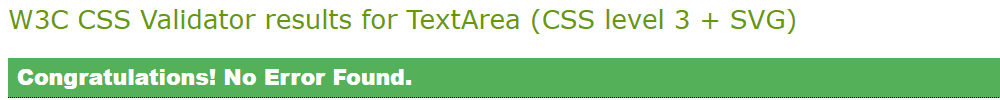

## Lighthouse Report
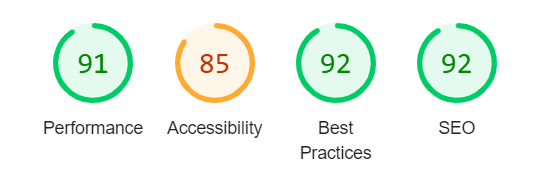
 
Three detrimental messages occur in the lighthouse report, for Best Practices:
 

## Bug

## Timezone Discrepancy in ElephantSQL

Issue Description: When setting up an instance on ElephantSQL, you noticed that the server's time was consistently one hour earlier than your expected timezone. This discrepancy in time resulted in all the posts being displayed with the incorrect timestamp.
 

### Bug Details:
 

- Origin: The issue originates from ElephantSQL, the service hosting your database.
- Impact: The bug affects the timestamps of all posts on your website, causing them to display with the wrong timezone.
- Cause: The cause of the issue appears to be related to the server's default timezone configuration.
-Resolution Difficulty: The bug couldn't be resolved on your end since it was related to the external service (ElephantSQL).

### Steps Taken:

- You likely checked and ensured that your Django application was correctly configured with the desired timezone settings.
- You might have reviewed the ElephantSQL settings and documentation to find a solution but couldn't locate a fix for this specific issue.
- The bug remained unresolved because it was beyond your control as it originated from the external database service.

### Impact on the Project:

- The bug had a noticeable impact on your project, affecting the accuracy of post timestamps, which is crucial for a blog or content-based website.

### Future Considerations:

- To address this bug, you might want to consider migrating your database to a different service or contacting ElephantSQL support for assistance.
- In future projects, it's essential to verify the timezone settings of any third-party services to ensure they align with your project's requirements.

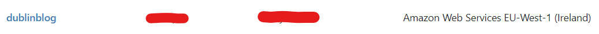

# Deployment

## Deploying on Heroku

Follow these steps to deploy your project on Heroku:

1. **Sign Up or Log In**: If you don't have an account, [create one on Heroku](https://www.heroku.com/) and log in.

2. **Create a New App**: In your Heroku dashboard, click "New" and choose "Create new app."

3. **Name Your App**: Pick a suitable name and choose your region.

4. **Set Environment Variables**:
   - Open the "Settings" tab.
   - Click "Reveal Config Vars."
   - Add key-value pairs from your .env file (excluding DEBUG and DEVELOPMENT variables).

5. **Add Python Buildpack**:
   - In "Settings," under "Add buildpack," select "python" from the list and save.

6. **Connect to GitHub**:
   - Visit the "Deploy" tab.
   - Choose "GitHub - Connect to GitHub" under deployment methods.
   - Find and select your GitHub repository.
   - Enable automatic deploys to update your site when you push code to GitHub.

7. **Preview Your Site**: Click "View" to see your deployed site on Heroku.

## Forking the Repository

To fork this repository on GitHub, follow these steps:

1. **Sign Up or Log In**: If you're not logged in, sign in to GitHub or create an account.

2. **Find the Repository**: Go to the GitHub Repository you want to fork.

3. **Fork the Repository**: Click the 'Fork' button in the top right corner.

4. **Rename Your Fork** (Optional): Customize the repository name as needed.

5. **Create Your Fork**: Click "Create Fork" to create your own version of the repository.

# References & Acknowledgements
- Gitpod repository template provided by [Code Institute](https://codeinstitute.net)
  

## General Reference
- [Python](https://www.python.org/)
- [PyPi](https://pypi.org/)
- [Real Python](https://realpython.com/)
- [Card Hover](https://ordinarycoders.com/blog/article/codepen-bootstrap-card-hovers)
- [Django Reference](https://docs.djangoproject.com/)
- [Django Slugs 1](https://forum.djangoproject.com/t/django-how-to-add-slug-as-arguments-in-url-tag-using-django/12636)
- [Django Slugs 2](https://forum.djangoproject.com/t/passing-slug-to-createview/4287)
- [Django AllAuth](https://django-allauth.readthedocs.io/en/latest/)

  

## Code Reference - Walkthroughs
The following walkthrough projects were used as inspiration and code was adapted for this project
- [Code Institute's 'Hello Django'](https://codeinstitute.net/)
- [Code Institute's 'CodeStar Blog'](https://codeinstitute.net/)
- [Alura.com](https://www.alura.com.br/)
 
 
